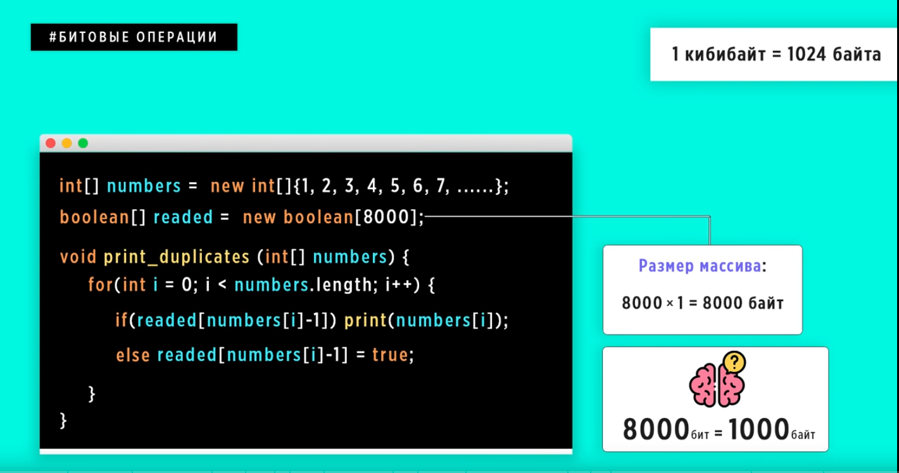
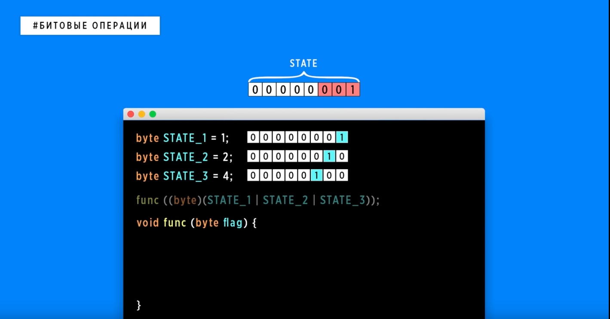
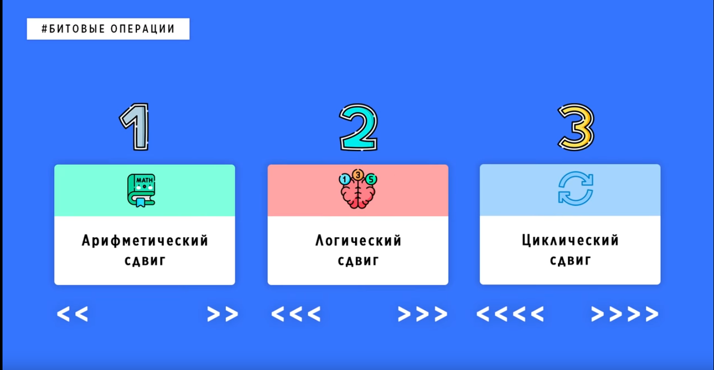
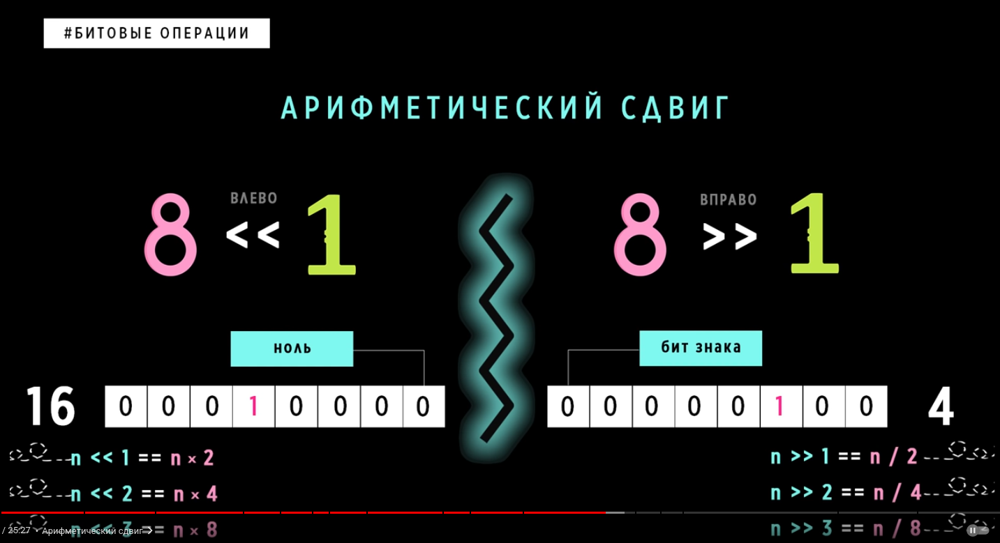

# пример работы с битовыми операциями на примере видео
<https://www.youtube.com/watch?v=qewavPO6jcA&list=PLIJLLSrXDPojDGKW0WZ7sU0eO3nyn0oDc&index=9>

- задача

- битовые операторы

- пример битовых операций

- вариации битового сдвига

- арифметический сдвиг
